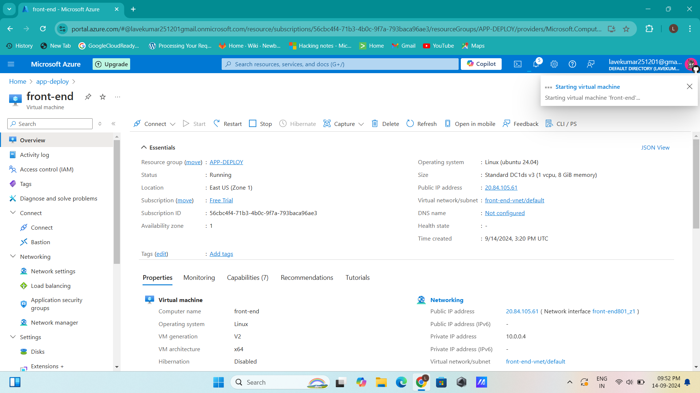

# Scalable E-Commerce Web Application

This repository contains the configuration and setup for deploying a scalable e-commerce web application using Azure Virtual Machines (VMs), Docker, and MySQL. The solution includes a front-end hosted on NGINX, a backend API built with Node.js, and a MySQL database containerized with Docker. The setup ensures high availability, security, and cost-efficiency.

## Project Overview

- **Front-End**: Static HTML page served using NGINX.
- **Back-End**: Node.js API interacting with a MySQL database.
- **Database**: MySQL running in a Docker container.
- **Infrastructure**: Deployed on Azure Virtual Machines with Docker Compose.
- **Security**: Configured using Azure Security Center and Network Security Groups (NSGs).
- **Monitoring**: Implemented using Azure Monitor with a health check cron job.

## Prerequisites

- Azure CLI installed and configured
- Docker and Docker Compose installed on backend VM
- Basic understanding of Docker, Docker Compose, and Azure

## Setup Instructions

### 1. Create Azure Virtual Machines

Use the provided script to create and configure the Azure VMs:

```bash


# Variables
RESOURCE_GROUP="myResourceGroup"
VM_NAME_FRONTEND="frontendVM"
VM_NAME_BACKEND="backendVM"
LOCATION="EastUS"
IMAGE="UbuntuLTS"
SIZE="Standard_B1s"
ADMIN_USER="azureuser"
ADMIN_PASSWORD="SecurePassw0rd!2024"

# Create Resource Group
az group create --name $RESOURCE_GROUP --location $LOCATION

# Create Front-End VM
az vm create \
  --resource-group $RESOURCE_GROUP \
  --name $VM_NAME_FRONTEND \
  --image $IMAGE \
  --size $SIZE \
  --admin-username $ADMIN_USER \
  --admin-password $ADMIN_PASSWORD \
  --generate-ssh-keys

# Create Back-End VM
az vm create \
  --resource-group $RESOURCE_GROUP \
  --name $VM_NAME_BACKEND \
  --image $IMAGE \
  --size $SIZE \
  --admin-username $ADMIN_USER \
  --admin-password $ADMIN_PASSWORD \
  --generate-ssh-keys

# Open Ports for HTTP/HTTPS
az vm open-port --resource-group $RESOURCE_GROUP --name $VM_NAME_FRONTEND --port 80
az vm open-port --resource-group $RESOURCE_GROUP --name $VM_NAME_FRONTEND --port 443
az vm open-port --resource-group $RESOURCE_GROUP --name $VM_NAME_BACKEND --port 80
az vm open-port --resource-group $RESOURCE_GROUP --name $VM_NAME_BACKEND --port 3306 # MySQL Port

# Output VM details
az vm show --resource-group $RESOURCE_GROUP --name $VM_NAME_FRONTEND --show-details --query [publicIps] --output tsv
az vm show --resource-group $RESOURCE_GROUP --name $VM_NAME_BACKEND --show-details --query [publicIps] --output tsv
```

### 2. Set Up Docker and MySQL on the Backend VM

Run the following script on your backend VM to install Docker, Docker Compose, and set up MySQL along with the backend API:

```bash
# docker_mysql_setup.sh
#!/bin/bash

# Update packages and install dependencies
sudo apt-get update
sudo apt-get install -y apt-transport-https ca-certificates curl software-properties-common

# Install Docker
curl -fsSL https://get.docker.com -o get-docker.sh
sudo sh get-docker.sh

# Add user to the Docker group
sudo usermod -aG docker $USER

# Install Docker Compose
sudo curl -L "https://github.com/docker/compose/releases/download/$(curl -s https://api.github.com/repos/docker/compose/releases/latest | grep tag_name | cut -d '"' -f 4)/docker-compose-$(uname -s)-$(uname -m)" -o /usr/local/bin/docker-compose
sudo chmod +x /usr/local/bin/docker-compose

# Create Docker Compose directory and file
mkdir -p ~/docker-compose
cd ~/docker-compose

# Create docker-compose.yml for MySQL and Backend API
cat <<EOF > docker-compose.yml
version: '3'
services:
  mysql:
    image: mysql:5.7
    container_name: ecommerce_mysql
    environment:
      MYSQL_ROOT_PASSWORD: RootPassw0rd!
      MYSQL_DATABASE: ecommerce_db
      MYSQL_USER: ecommerce_user
      MYSQL_PASSWORD: UserPassw0rd!
    ports:
      - "3306:3306"
    volumes:
      - mysql_data:/var/lib/mysql

  backend:
    image: your-backend-image:latest
    container_name: ecommerce_backend
    ports:
      - "80:80"
    depends_on:
      - mysql
    environment:
      DB_HOST: mysql
      DB_USER: ecommerce_user
      DB_PASSWORD: UserPassw0rd!
      DB_NAME: ecommerce_db

volumes:
  mysql_data:
EOF

# Start Docker containers
sudo docker-compose up -d

# Check Docker status
sudo docker ps
```

### 3. Configure the Cron Job

Set up a cron job on the backend VM to check the health of the MySQL database:

```bash
# cron_job_setup.sh
#!/bin/bash

# Create the health check script
cat <<EOF > /usr/local/bin/db_health_check.sh
#!/bin/bash

LOGFILE="/var/log/db_health.log"
mysqladmin -u ecommerce_user -p'UserPassw0rd!' ping > \$LOGFILE 2>&1

if [ \$? -eq 0 ]; then
  echo "\$(date): Database is up" >> \$LOGFILE
else
  echo "\$(date): Database is down" >> \$LOGFILE
fi
EOF

# Make the script executable
sudo chmod +x /usr/local/bin/db_health_check.sh

# Add cron job
(crontab -l 2>/dev/null; echo "*/10 * * * * /usr/local/bin/db_health_check.sh") | crontab -
```

### 4. Set Up Azure Monitor

1. **Enable Monitoring**:
   - Go to the [Azure Portal](https://portal.azure.com).
   - Navigate to **Monitor** and **Create a New Alert Rule** for your VMs.

2. **Configure Metrics**:
   - Set up metrics for CPU usage, memory, and disk I/O.

3. **View Logs**:
   - Use the **Logs** section in Azure Monitor to query and view logs.

## Testing the Application

1. **Access Front-End**:
   - Navigate to the public IP of the front-end VM to view the e-commerce website.

2. **Test API Endpoints**:
   - Use Postman or cURL to test the API endpoints and ensure they are interacting with the MySQL database.

   Example cURL command:
   ```bash
   curl -X GET http://<frontend_vm_ip>/api/products
   ```

## Troubleshooting

- **API Not Accessible**:
  - Check if the Docker containers are running (`sudo docker ps`).
  - Verify network security group settings and firewall rules.

- **Database Connection Issues**:
  - Check the MySQL container logs (`sudo docker-compose logs mysql`).
  - Ensure the database credentials in the backend API are correct.

## Contribution

Feel free to submit issues or pull requests if you have improvements or suggestions.

## License

This project is licensed under the MIT License - see the [LICENSE](LICENSE) file for details.

---

Feel free to adjust the passwords, IP addresses, and any other specific details according to your setup. This README file should provide a clear guide for setting up and managing your e-commerce application.
